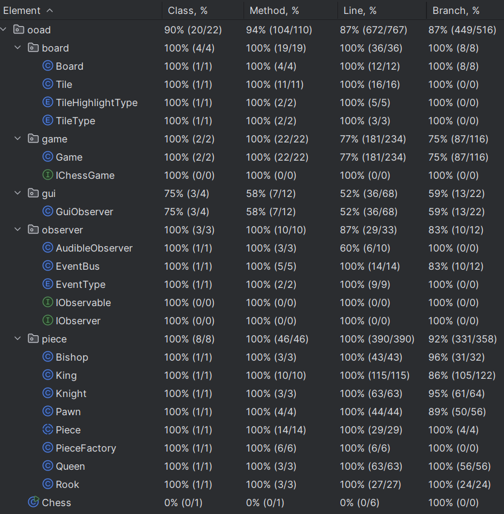
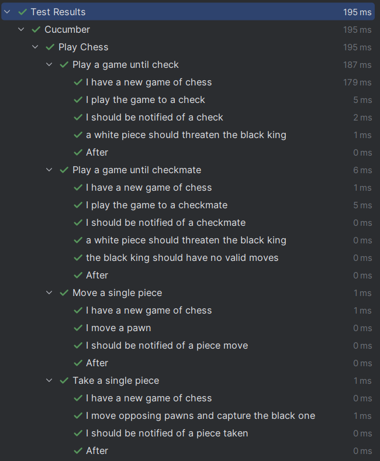
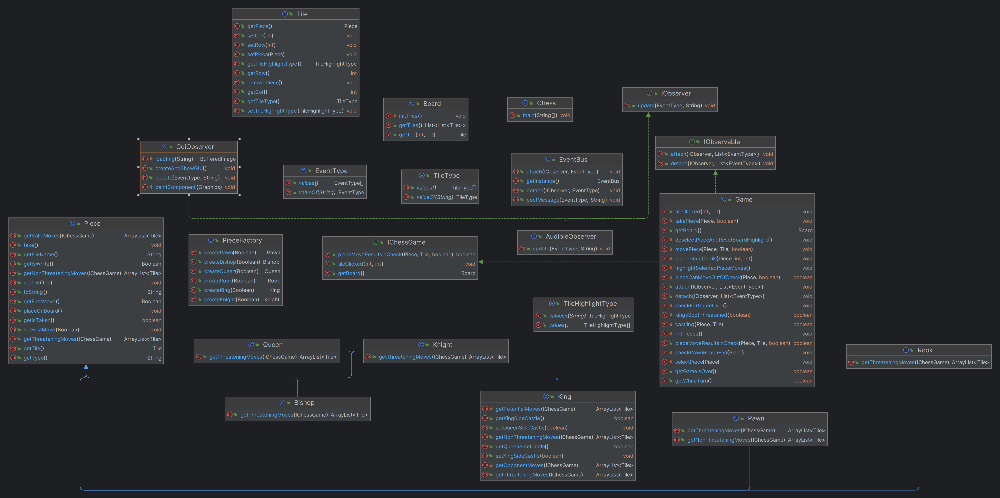

# OOAD Final Project: Graphical Chess

### Team Members:

1. Ian Scheuermann
2. Igor Overchuk
3. May An van de Poll

### Java Version: 17

### Gradle: 8.5

#### Code Coverage

#### Cucumber Test Output

#### UML

### Interim Deliverables

Status Update PDF is located at `interimDeliverables/Homework7Update.pdf`

UML Class Diagram is located at `interimDeliverables/UML.png`

Recorded Demonstration is located at `interimDeliverables/interimVideoReport.mkv`

BDD Scenarios are written out in `src/test/resources/hellocucumber/chess.feature`
